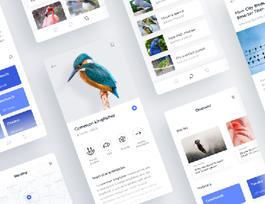

# BirdAtlasMaui

## Design
Based upon [Dribbble project](https://dribbble.com/shots/5442850-Bird-Atlas-App) created by [Monika Michalczyk](https://dribbble.com/michalczyk):

## Development
- MAUI used (and .NET 6). The solution contains iOS, MacCatalyst, Android, Tizen and UWP projects.
- Main music track (as background task)): Geometry Dash - Geometrical dominator (lvl 19)

## Used app ("app templates")
- https://github.com/AppCreativity/BirdAtlas  (MAUI version seems to be more userful then XF...)
- https://www.birdlife.org

## Status
I catched this:
System.InvalidOperationException: "No service for type 'BirdAtlasMaui.ViewModels.MainViewModel' has been registered."
Idk how to say... Epic fail? :)  No ideas how to fix it, heh!

## .
- me

